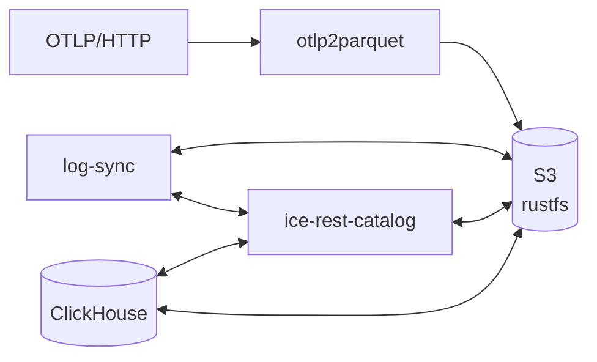

# ClickHouse + OTLP Logs

Ingest OpenTelemetry logs via OTLP/HTTP and query them with ClickHouse.

## Architecture



# Quick Start

## Step 1: Start Docker

```bash
docker compose up -d
```

Services:
- **otlp2parquet**: `localhost:4318` - OTLP/HTTP ingestion
- **ClickHouse**: `localhost:8123`
- **rustfs console**: `localhost:9001` - S3 web UI (rustfsuser/rustfspassword)
- **ice-rest-catalog**: `localhost:5001` - Iceberg REST catalog
- **log-sync**: Automatically syncs parquet files to Iceberg (every 60s by default)

## Step 2: Send Test Logs

Later, we can hook up OpenTelemetry SDKs or Collectors, but for now let's send some test logs to verify our set-up. Run this command 2-3 times:

```bash
curl -X POST http://localhost:4318/v1/logs \
  -H "Content-Type: application/json" \
  -d '{
    "resourceLogs": [{
      "resource": {
        "attributes": [{"key": "service.name", "value": {"stringValue": "my-app"}}]
      },
      "scopeLogs": [{
        "scope": {"name": "my-scope"},
        "logRecords": [{
          "timeUnixNano": "'$(date +%s)'000000000",
          "severityText": "INFO",
          "body": {"stringValue": "Hello from my-app!"}
        }]
      }]
    }]
  }'
```

## Automatic Sync

The **log-sync** service automatically registers new parquet files with Iceberg every 60 seconds (configurable via `LOG_SYNC_INTERVAL` env var).

Just send logs and query - no manual registration needed!

Logs are batched and flushed every 10 seconds (or 200k rows / 128MB), so they may take a moment to appear.

## View Grafana Dashboard

There is a [Grafana dashboard](http://localhost:3000) with some basic panels for viewing logs (available at `localhost:3000`)

## Query Logs

Alternatively, you can query the Iceberg tables directly from ClickHouse:

```
# Using clickhouse client
clickhouse client --query "SELECT ServiceName, SeverityText, Body, Timestamp FROM ice.\`otel.logs\`"
```

The `ice` database is configured as a DataLakeCatalog pointing to ice-rest-catalog.

### Schema

The schema follows the OpenTelemetry Collector Exporter for ClickHouse. For example, `otel.logs`:

| Column | Type | Description |
|--------|------|-------------|
| Timestamp | DateTime64(6) | Log timestamp |
| ServiceName | String | service.name resource attribute |
| SeverityText | String | Log level (INFO, WARN, ERROR, etc.) |
| SeverityNumber | Int32 | Numeric severity |
| Body | String | Log message |
| TraceId | String | Trace ID (if present) |
| SpanId | String | Span ID (if present) |
| ResourceAttributes | Map(String, String) | Resource attributes |
| LogAttributes | Map(String, String) | Log attributes |
| ScopeName | String | Instrumentation scope name |

## Example Queries

```sql
-- Recent logs
SELECT Timestamp, ServiceName, SeverityText, Body
FROM ice.`otel.logs`
ORDER BY Timestamp DESC
LIMIT 10;

-- Severity count by service
SELECT ServiceName, SeverityText, count()
FROM ice.`otel.logs`
GROUP BY ServiceName, SeverityText;
```

## Sending Telemetry to the OTLP Endpoints

The otlp2parquet service exposes OTLP-compatible endpoints that can talk with any OTLP-compatible source. You can export telemetry from an application or agent, or you can use something like [otelgen](https://github.com/krzko/otelgen) to generate more test telemetry to experiment with.

### OpenTelemetry SDK

Configure your app's OTLP exporter:

```yaml
# environment variables
OTEL_EXPORTER_OTLP_ENDPOINT=http://localhost:4318
OTEL_EXPORTER_OTLP_PROTOCOL=http/json
```

### OpenTelemetry Collector

```yaml
exporters:
  otlphttp:
    endpoint: http://localhost:4318
    tls:
      insecure: true

service:
  pipelines:
    logs:
      exporters: [otlphttp]
```

## Manual Registration of Logs (Optional)

You shouldn't need to do this, but if you want to manually register files:

```bash
# List parquet files
docker run --rm --network demo-otel-parquet-antalya_default --entrypoint="" minio/mc sh -c "
mc alias set local http://rustfs:9000 rustfsuser rustfspassword >/dev/null 2>&1
mc find local/bucket1/logs --name '*.parquet'
"

# Create namespace (first time only)
docker compose run --rm ice create-namespace otel

# Insert files using HTTP URLs (use http://rustfs:9000/bucket1/... instead of s3://bucket1/...)
docker compose run --rm ice insert -p --skip-duplicates otel.logs \
  "http://rustfs:9000/bucket1/logs/my-app/year=2026/month=01/day=12/hour=16/file.parquet"
```

## Cleanup

Some data is stored locally in `./data`:

```bash
# Stop services
docker compose down

# Remove all data
docker compose down -v
rm -rf ./data
```

## Credits

- [otlp2parquet](https://github.com/smithclay/otlp2parquet): many thanks to [@smithclay](https://github.com/smithclay) for creating the OTLP to Parquet converter used in this project.

## Community

This project is a community effort sponsored by Altinity. The best way to reach us or ask questions is:

* Join the [Altinity Slack](https://altinity.com/slack) - Chat with the developers and other users
* Log an [issue on GitHub](https://github.com/Altinity/clickhouse-parquet-logs/issues) - Ask questions, log bugs and feature requests

## Contributing

We welcome contributions from the community! If you encounter issues or have improvements to suggest, please log an issue or submit a PR.

## Legal

All code, unless specified otherwise, is licensed under the [Apache-2.0](LICENSE) license.
Copyright (c) 2026 Altinity, Inc.
Altinity.Cloud®, and Altinity Stable® are registered trademarks of Altinity, Inc. ClickHouse® is a registered trademark of ClickHouse, Inc.; Altinity is not affiliated with or associated with ClickHouse, Inc. Kubernetes, MySQL, and PostgreSQL are trademarks and property of their respective owners.

## Commercial Support

This project is a demonstration meant to showcase ClickHouse's capabilities. Altinity offers a range of services related to ClickHouse and analytic applications:

- [Official website](https://altinity.com/) - Get a high level overview of Altinity and our offerings.
- [Altinity.Cloud](https://altinity.com/cloud-database/) - Run ClickHouse in our cloud or yours.
- [Altinity Support](https://altinity.com/support/) - Get Enterprise-class support for ClickHouse.
- [Slack](https://altinity.com/slack) - Talk directly with ClickHouse users and Altinity devs.
- [Contact us](https://hubs.la/Q020sH3Z0) - Contact Altinity with your questions or issues.
- [Free consultation](https://hubs.la/Q020sHkv0) - Get a free consultation with a ClickHouse expert today.
